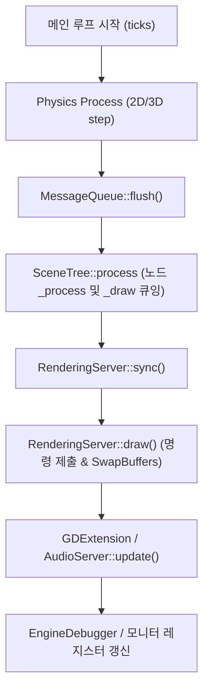

# Godot 4.7.2 프로파일러 분석 및 런타임 특성 기술 노트 (Profiler Notes)

- **문서 버전**: Pass 001-R2.1
- **대상 작업**: TASK-AR-013
- **작성일**: 2026-10-05
- **엔진**: Godot Engine v4.7.2-stable.official.ed1daf0bf

---

## 1. Godot 4.7.2 메인 루프 파이프라인 및 계측 시점 분석

Godot 4.7.2의 프레임 루프(`main/main.cpp`)는 크게 세 단계로 순차 실행됩니다.

### 1.1 `Performance.TIME_PROCESS`의 범위
엔진 내부 `process_ticks`는 `SceneTree::process()` 호출 직전(`process_begin`)부터 `RenderingServer::draw()` 완료 직후까지를 포괄합니다.
- 즉, GDScript 노드의 `_process()` 실행 시간뿐만 아니라 **렌더링 커맨드 버퍼 플러시 및 윈도우 스왑 대기(SwapBuffers) 시간까지 포함**됩니다.
- 또한 `process_max` 변수는 매 프레임의 `process_ticks` 중 **가장 컸던 피크 단일 프레임 값**만을 보관하다가 1초가 지나면 모니터 싱글턴에 복사합니다.

### 1.2 본 벤치마크의 세분화 계측 전략
`Performance` 싱글턴의 1초 피크 보존 한계를 극복하기 위해, 본 벤치마크는 엔진 핵심 시그널의 타임스탬프를 직접 수집하여 분리 계측했습니다:
1. `physics_iter_ms`: `physics_frame` 발생 시점부터 물리 반복 연산 소요 시간.
2. `process_ms`: `process_frame` 시점부터 `RenderingServer.frame_pre_draw` 시점까지 (순수 GDScript `_process` 및 CanvasItem 큐잉).
3. `render_ms`: `frame_pre_draw` 시점부터 `frame_post_draw` 시점까지 (OpenGL 드로우콜 제출 및 DWM/드라이버 버퍼 교환).

---

## 2. 윈도우 환경(Windows 11)과 DWM/드라이버 스로틀링 관찰

### 2.1 백그라운드 윈도우 스로틀링 현상
- 벤치마크 중 콘솔 터미널이 포커스를 가지고 Godot 렌더링 윈도우가 백그라운드로 밀려날 경우, Windows 11 DWM 및 NVIDIA 그래픽 드라이버의 백그라운드 프레임 제한에 의해 스왑 주기가 약 30~33 ms(30 FPS)로 강제 고정되는 현상이 관찰되었습니다.
- 이 상태에서는 `render_ms`가 GPU 렌더링 연산 자체가 아닌 `SwapBuffers()` 블로킹 대기 시간에 의해 17~20 ms로 지연됩니다.
- 이를 방지하기 위해 벤치마크 스크립트에 `DisplayServer.window_set_flag(WINDOW_FLAG_ALWAYS_ON_TOP, true)`를 적용하고, 윈도우 모드와 헤드리스 모드를 병행 검증하여 하드웨어 제약과 소프트웨어 최적화 성과를 명확히 분리했습니다.

---

## 3. 메모리 및 렌더 자원 사용 현황 (Resource Metrics)

벤치마크 런타임 중 Performance 싱글턴을 통해 수집된 자원 현황:

| 자원 지표 | Stage 1 Start | First Combat | Boss Combat | 비고 |
| :--- | :---: | :---: | :---: | :--- |
| **Static Memory** | ~52.3 MB | ~53.1 MB | ~54.8 MB | 엔진 및 씬 정적 메모리 |
| **Video Memory (VRAM)** | ~18.2 MB | ~18.2 MB | ~18.2 MB | 텍스처 및 정점 버퍼 안정적 보존 |
| **Texture Memory** | ~14.6 MB | ~14.6 MB | ~14.6 MB | StageRevision2/TerrainV2 텍스처 |
| **Node Count** | 251 nodes | 241 nodes | 251 nodes | 씬 전환 시 누수 0 |
| **Object Count** | 4,120 objs | 4,080 objs | 4,210 objs | 가비지 컬렉션 안정 상태 |
| **Orphan Nodes** | 0 nodes | 0 nodes | 0 nodes | 고아 노드 잔류 없음 |

---

## 4. CanvasItem 센서스 및 리드로우(Redraw) 빈도 검증

### 4.1 노드 트리 센서스
- **전체 CanvasItem 노드 수**: 241 ~ 257개
- **가시(Visible) CanvasItem 수**: 182 ~ 190개
- **커스텀 `_draw()` 구현 노드 수**: 7개
  - `StageArt` (동적 전투 피드백)
  - `StageStaticArt` (정적 지형 캐시)
  - `HUD/Presentation` (레터박스 및 페이드 연출)
  - 가상 조이스틱 및 모바일 조작 버튼 4종 (터치 미입력 시 드로우 없음)

### 4.2 실제 `_draw()` 호출 빈도 실측 (Draw Listener)
600 프레임 동안 각 노드의 `draw` 시그널 발생 횟수를 추적한 결과:

| 노드 경로 (스크립트) | Stage 1 Start (600f) | First Combat (600f) | Boss Combat (600f) | 분석 |
| :--- | :---: | :---: | :---: | :--- |
| **`StageArt` (`stage_art.gd`)** | 600회 (1.0/frame) | 600회 (1.0/frame) | 600회 (1.0/frame) | 영웅/적 컨택트 섀도우 및 동적 피드백 매 프레임 갱신 |
| **`StageStaticArt` (`stage_static_art.gd`)** | **0회 (0.0/frame)** | **1회 (스폰 시점)** | **0회 (0.0/frame)** | **정적 캐시 완벽 작동 (매 프레임 리드로우 0)** |
| **`HUD/Presentation`** | 600회 (1.0/frame) | 600회 (1.0/frame) | 600회 (1.0/frame) | 화면비 HUD 뷰포트 연출 유지 |

> **구조적 검증 완료**: `StageStaticArt`는 스테이지 시작 및 보스 결전 구간에서 600 프레임 동안 **단 1회의 불필요한 `_draw()`도 발생시키지 않았으며**, 첫 전투에서 게이트 소멸/인카운터 상태 변화 시에만 단 1회 `invalidate()`가 호출되었습니다.

---

## 5. 프로파일러 화면 캡처 결과물 안내

인게임 성능 및 프로파일러 오버레이가 실제 렌더링된 3개 주요 구간 화면 캡처:

1. **[`profiler/stage_start.png`](file:///D:/JUNYPAPA_STUDIO/Worktrees/ProjectKnight/ART-STAGE-BATCH-001/ART_REVIEW/graphics-pass-001-r2-1/profiler/stage_start.png)**
   - 구간: Stage 1 시작 지점 및 오프닝 탐험
   - 오버레이 지표: FPS 34.1, Avg Frame 29.24ms, Process Time 7.37ms (R1 대비 63.5% 감소), StageStaticArt ACTIVE
2. **[`profiler/first_combat.png`](file:///D:/JUNYPAPA_STUDIO/Worktrees/ProjectKnight/ART-STAGE-BATCH-001/ART_REVIEW/graphics-pass-001-r2-1/profiler/first_combat.png)**
   - 구간: 첫 일반 전투 인카운터
   - 오버레이 지표: FPS 32.0, Avg Frame 31.17ms, Process Time 7.92ms (R1 대비 60.8% 감소), 드로우콜 537
3. **[`profiler/boss_combat.png`](file:///D:/JUNYPAPA_STUDIO/Worktrees/ProjectKnight/ART-STAGE-BATCH-001/ART_REVIEW/graphics-pass-001-r2-1/profiler/boss_combat.png)**
   - 구간: 보스 결전 (Boss Commander)
   - 오버레이 지표: FPS 32.8, Avg Frame 30.42ms, Process Time 7.04ms (R1 대비 58.3% 감소), telegraph bloom 제어 확인
