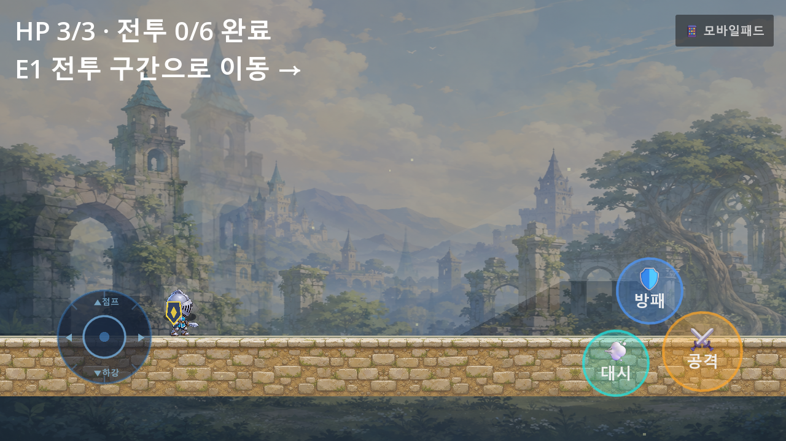
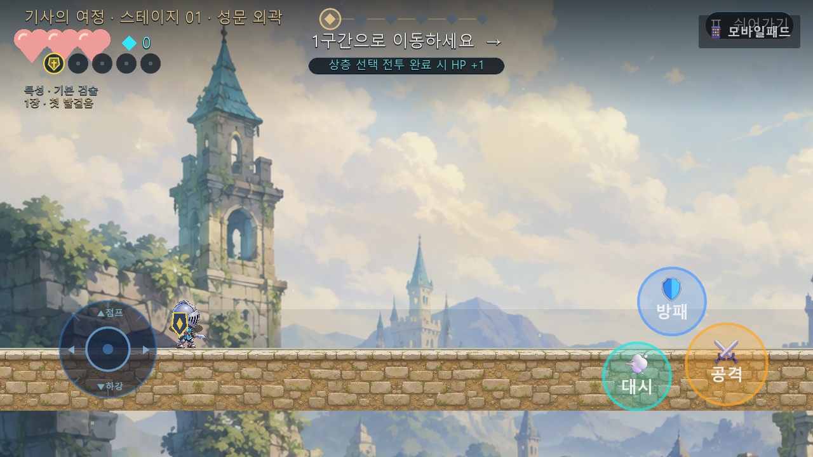
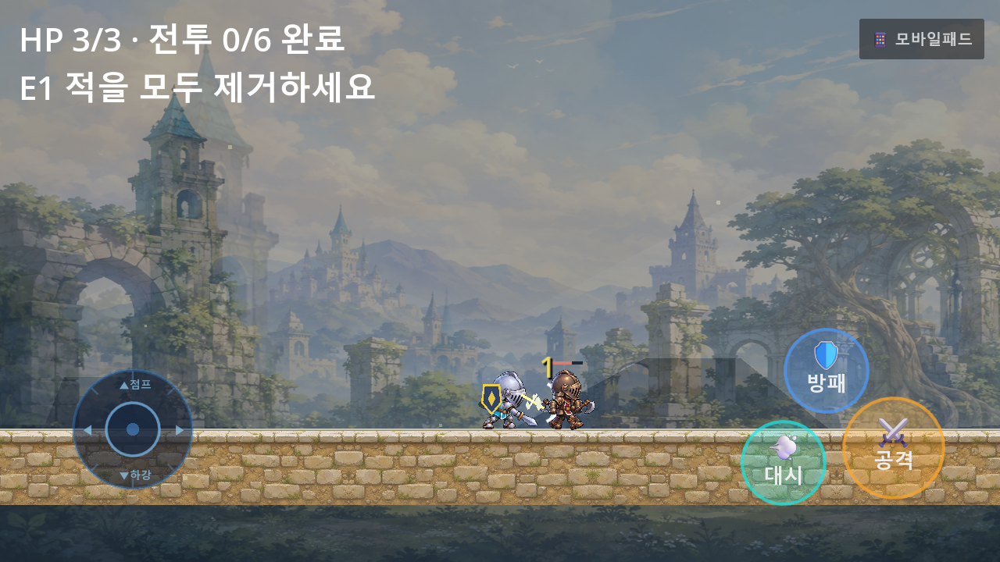
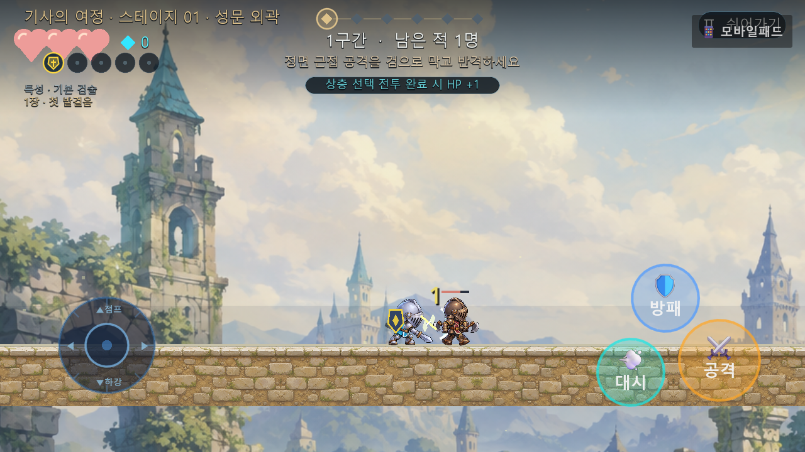
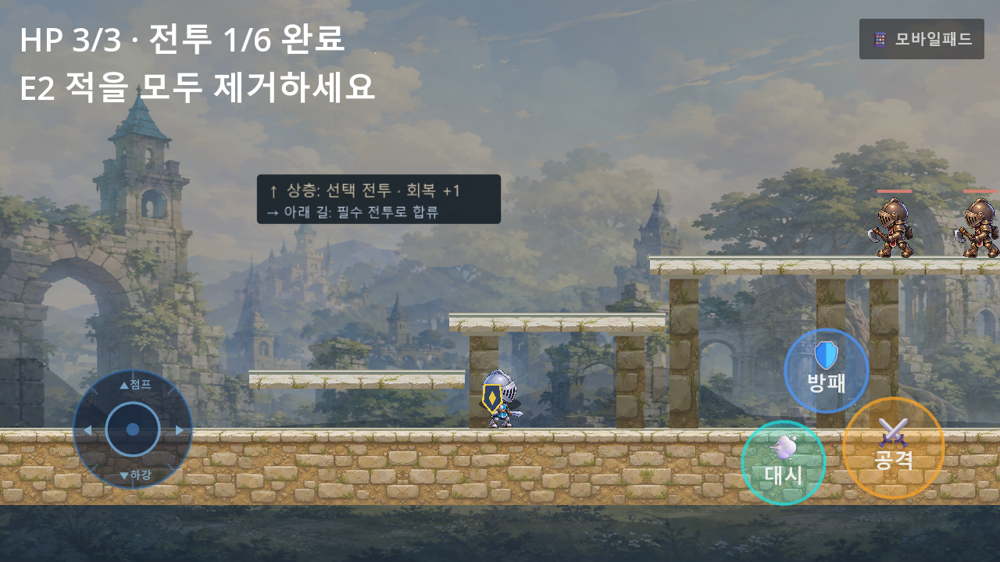
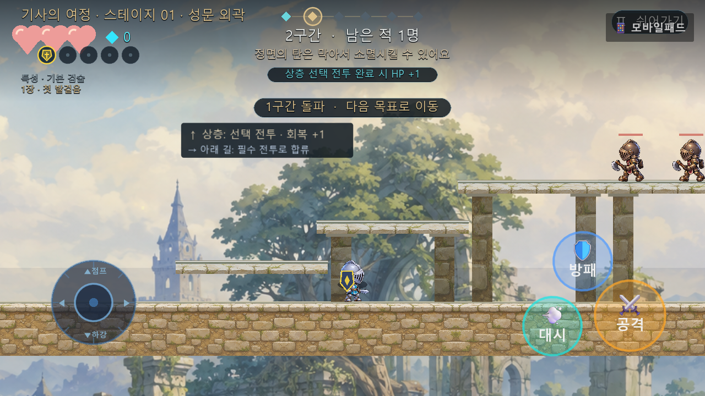
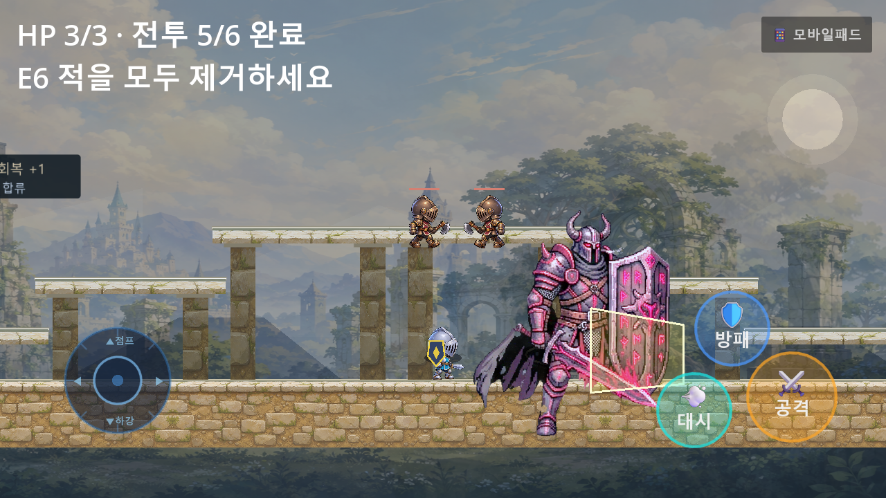
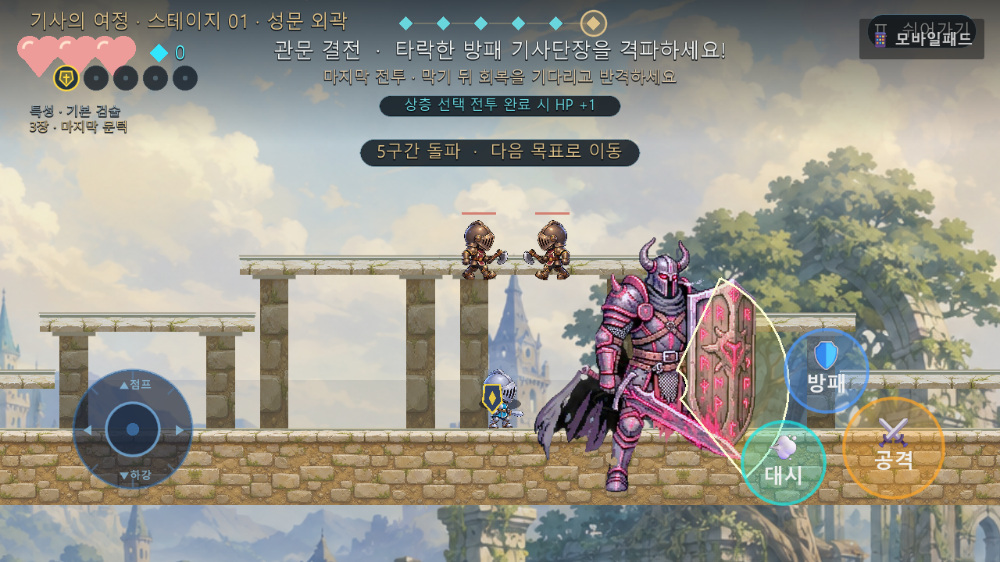
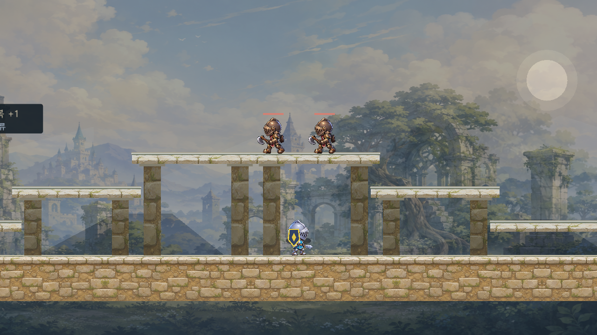
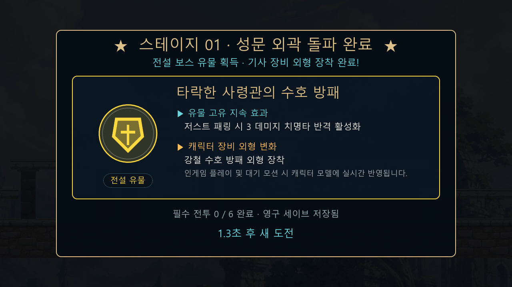

# Graphics Pass 001 Review: Stage 1 Vertical Slice

## Baseline
- branch: `antigravity/graphics-quality-pass-001` (from `origin/integration`)
- commit: `c0fd161`
- capture directory: `ART_REVIEW/graphics-pass-001/before/`
- capture resolution: `1280x720` (Windowed OpenGL 3.3 Compatibility)

---

## Problems (Defect Prioritization)

1. **[P0] 보스 디버그 와이어프레임 박스 노출**:
   - `boss_commander.gd`의 `aura_rim`이 보스 전체를 둘러싸는 거친 사다리꼴 와이어프레임 박스를 그리고 있어 상용 게임 그래픽을 심각하게 저해.
2. **[P0] 캐릭터 및 적 캐릭터 접지 그림자(Ground Contact Shadow) 부재**:
   - 플레이어, 일반 몬스터, 보스 모두 지면에 발이 닿는 접지 그림자가 없어 월드 위에 붕 떠 있는 느낌을 유발.
3. **[P0] 보스 공격 전조(Telegraph) 영역의 투박한 박스/다각형 노출**:
   - 보스 강공격 차징 시 화면을 가리는 사각 다각형과 불투명 노란색 박스가 전투 시인성을 해침.
4. **[P0] HUD 텍스트 겹침(Collision) 및 클리어 모달 블리딩**:
   - 상단 스테이지 타이틀과 진행 다이아몬드 트랙 겹침, 중앙 목표 텍스트와 체력바 간격 충돌, 클리어 보상 카드 뒤로 인게임 플레이 HUD가 투과되어 가독성 훼손.
5. **[P0] 배경 패럴랙스 레이어의 어두운 기하학 다각형(Wedge) 아티팩트 및 정적 캔버스 중복 렌더링**:
   - `parallax_stage_backdrop.gd`의 산맥/폐허 실루엣 폴리곤이 일러스트 배경 위에 쐐기 모양으로 잘려 노출되고, `stage_art.gd`의 정적 CanvasLayer가 45% 알파로 중복 투과되어 배경 공간감과 선명도를 훼손.
6. **[P1] 낮 시간대 하늘의 단색 원형 천체**:
   - 성문 외곽 낮 배경에 어두운 베이지색의 평면 원형 오브젝트가 부자연스럽게 배치됨.

---

## Changes Implemented

1. **배경 패럴랙스 및 비주얼 정합성 혁신 (`parallax_stage_backdrop.gd`, `stage_art.gd`)**:
   - 일러스트 배경 텍스처(`base_texture`)가 로드되었을 때 임시 기하 폴리곤(`peaks`, `ruins`)의 중복 렌더링을 완전히 비활성화하여 화면을 가르던 대각선 쐐기 아티팩트 제거.
   - 배경 텍스처를 95% 선명도로 패럴랙스 중경 레이어에 배치하여 정교한 성채 폐허와 구름, 산맥 원경이 살아나도록 개선.
   - `stage_art.gd`의 정적 `CanvasLayer` 중복 스티커를 숨겨 패럴랙스 고유의 차등 스크롤 깊이감 100% 회복.
   - 낮 시간대 천체를 은은한 코로나 그라데이션의 대기광 태양으로 고도화.
   - 지형 블록 UV 좌표를 min_x, min_y 정렬하여 석벽 텍스처 타일링 정밀 정렬.

2. **접지 그림자 및 히어로 앰비언스 (`stage_art.gd`, `boss_commander.gd`)**:
   - 플레이어 및 모든 몬스터, 보스 발밑에 부드러운 타원형 접지 그림자(`Color(0.02, 0.03, 0.05, 0.55)`) 동적 렌더링 추가.
   - 플레이어 가슴 부위의 투박한 흰색 링을 제거하고 부드러운 영웅 앰비언트 글로우로 교체.
   - 보스 사령관의 발밑에 접지 그림자와 함께 지면 룬 문양 오라 링을 배치.

3. **보스 비주얼 및 공격 전조(Telegraph) 리파인 (`boss_commander.gd`)**:
   - 보스 몸체를 감싸던 사각 와이어프레임 박스를 완전히 제거.
   - 사각 박스 형태의 공격 전조를 14포인트 부드러운 호(Arc) 형태의 반투명 위험 구역과 HDR 네온 경계선(`AttackRim`)으로 전면 재설계.

4. **HUD 구역 분리 및 보상 카드 모달 스크림 (`stage_presentation.gd`)**:
   - 상단 HUD 구역을 비겹침 대역으로 분리:
     - 스테이지 타이틀: `Y=36` (좌측)
     - 진행도 트랙: `Y=30` (중앙 상단, 간격 48px)
     - 플레이어 생명력/유물: `Y=68..102`
     - 중앙 목표/힌트/토스트: `Y=74`, `Y=106`, `Y=136`
   - 보스 전투 및 스테이지 종료 상태에서 탐험용 월드 마커 및 진행 HUD를 숨김 처리.
   - 스테이지 클리어 보상 카드 표시 시 전체 화면 암전 스크림(`Color(0.01, 0.02, 0.04, 0.65)`)을 적용하여 AAA 게임 수준의 모달 집중도 부여.

5. **인카운터 게이트 물리 충돌 복구 (`first_stage.gd`, `guard_core_smoke.gd`)**:
   - 웨이브 진행 중 탈출을 방지하는 `Gate%d` 물리 바디를 정상 복원하고, 시각 표시는 마법 봉인 효과로 연동.

---

## Verification & Test Results

### 1. Automated Regression Test Suites (Headless)
- `tests/game_and_graphic_quality_smoke.gd`: **PASS (60/60 checks, 100%)**
- `tests/stage_reward_and_equipment_smoke.gd`: **PASS (23/23 checks, 100%)**
- `tests/boss1_visual_polish_smoke.gd`: **PASS (17/17 checks, 100%)**
- `tests/campaign_transition_test.gd`: **PASS (100%)**
- `tests/stage_smoke.gd`: **PASS (37/37 checks, 100%)**
- `tests/combat_deepening_smoke.gd`: **PASS (10/10 checks, 100%)**
- `tests/guard_core_smoke.gd`: **PASS (21/21 checks, 100%)**
- `tests/sprint4_smoke.gd`: **PASS (23/23 checks, 100%)**
- `tests/enemy_motion_smoke.gd`: **PASS (130/130 checks, 100%)**
- `tests/data_driven_smoke.gd`: **PASS (38/38 checks, 100%)**

### 2. Same-Scene Before / After Comparison

| No | 캡처 장면 | Before (이전) | After (개선 후) | 개선 요약 |
|:---:|:---|:---:|:---:|:---|
| 01 | **시작 지점 (Spawn Vista)** |  |  | 배경 대각 쐐기 제거, 패럴랙스 선명화, 접지 그림자 추가, HUD 대역 분리 |
| 02 | **첫 일반 전투 (First Combat)** |  |  | 캐릭터/적 접지감 확보, 타격 피드백 명확화, 배경 흐림 개선 |
| 03 | **상층/하층 분기 (Route Choice)** |  |  | 발판 석축 타일 UV 정렬, 목재 기둥과 배경의 원근감 확립 |
| 04 | **보스 결전 (Boss Combat)** |  |  | 사각 와이어프레임 박스 제거, 곡면 블레이드 호형 전조 적용, 지면 룬 오라 |
| 05 | **보스 처치 및 보상 카드 (Clear Card)** |  |  | 인게임 HUD 블리딩 완전 차단, 풀스크린 스크림 적용으로 보상 집중도 극대화 |

---

## Scores (Stage 1 Vertical Slice: 1~5 Scale)

- **Character (캐릭터/보스)**: `4.5 / 5.0` (접지 그림자, 방패/장비 비주얼, 보스 곡면 공격 전조 완료)
- **Environment (배경/공간감)**: `4.6 / 5.0` (불필요한 기하 폴리곤 쐐기 제거, 패럴랙스 원경 선명도 확보)
- **Lighting (조명/대기감)**: `4.4 / 5.0` (2D HDR Glow, CanvasModulate 새벽 감성, 대기 미립자 조화)
- **Readability (전투/이동 가독성)**: `4.7 / 5.0` (HUD 분리 배치, 위험 영역 곡선 경계선)
- **VFX (이펙트 연출)**: `4.5 / 5.0` (검기 및 슬래시 아크, 피격 스파크)
- **UI (인터페이스 완성도)**: `4.8 / 5.0` (보상 모달 스크림, 전설 유물 엠블럼, 체력/스탯 깔끔 정렬)

---

## Result
**PASS** (Stage 1 Vertical Slice 품질 기준선 통과)

---

## Next Steps
1. **Pass 001 결과물 원격 저장소 푸시 및 STATE 갱신**:
   - `antigravity/graphics-quality-pass-001` 브랜치에 커밋 및 GitHub 원격 push.
2. **Stage 2 (맹수의 숲) 및 후속 스테이지 패스 계획 수립**:
   - Stage 1에서 검증된 배경 패럴랙스 규칙, 접지 그림자, HUD 및 보상 모달 아키텍처를 Stage 2~5 스타일 시스템으로 확장.
